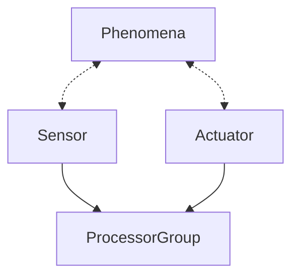

<head>

</head>

<h1> Trappy-Scopes :: an open-source experimentation framework </h1>

---

**Trappy-Scopes** is a framework for creating instruments and doing experiments. Our goal is to combine and extend the capabilities of the scientific python ecosystem. Here you will find a [list of pyhton packages for instrumentation](), a [list of open-hardware projects](), various instructions, but above all — a general framework for building and running instruments that focuses on <u>fast prototyping, parallelisation, and quick deployment</u> ([Trappy-Philosophy](#The Trappy-Philosophy)).

Trappy-Scopes grow out of a requirement to build — a *low-cost*, *custom*, *programmable*, and *parallelisable* imaging system for recording swimming micro-organisms. We needed many individual "crappy-scopes" that could operate individually, but could be synchronised when needed. We took inspiration from 3D-printing farms and decided to stack many simple units in parallel connected by a network. In the meantime, we also decided to 3D print the majority of the mechanical components. We stacked a few Raspberry-Pi(es) and gave each of them their own Raspberry-Pi Pico(s) for computing. A camera, and a few resistors, and capacitors later we had the hardware ready. Then some code to run the microscopes, more code to synchronise and you have the whole system running. A whole lab running in sync on python and micropython. We used it to "trap" cells and called it "Trappy-Scopes" from there after.

We learned that to build, we need:

+ **Mechanics**: 3D printing, a little bit of steel, and some aluminium.
+ **Electronics**: Microcontrollers, and a soldering iron.
+ **Software**: python and micropython.
+ A couple of **sensors**, and **actuators** of your choice.

And we have a working instrument. The control layer framwork allows you to combine these basic elements in arbitrary ways to make complex machines. Here we will document and streamline this process. And reduce the the time **it takes to do this from a week to maybe a day or two.** 

**Experimentation** is no easy business and it is not easy to build research quality instruments. A huge part of it is documentation, reproducability, and data management. A large part of the framework is dedicated to this pursit with the aim to automate most of this process.

# The Trappy-Philosophy

### Science should be open-source, reproducible, and  well-documented.

**Experiments start with (software-defined) Instruments**, which can be custom built. The most basic instrument is a combination of a computer (`ProcessorGroup`), a few sensors, and actuators. Actuators move to produce phenomena, which sensors record. The comuter stores the recorded information and controls the process. This is better known as a **software defined instruments **. A simple instrument  (or **scope**)can be defined as follows:

**Processors are cheap, fast, and abundant**,  which means that the instruments can be easily *software defined*, and most of the control is done by software. All the peripherals (sensors, actuators, and monitors) are attached to a processor which controls them through user defiend code. 

**python is at the core of everything**, the experiments are programmed at a high-level using  `python`, which enables fast integrations and broad portability. Micro-controllers are programmed in `micropython` which means that language syntax is compatible. Direct use of python enables interactive use as well. Operations requiring speed or low-level programming can be done using languages like `C` and called using python.

**Experiments must be self-describing,** which means that the script that runs the experiment also defines the purpuse and intent of the data collection. This is achieved entirely by following a certsin programming style and by making the experimenter (or the `User`)  a part of the control flow. The User also documents and logs his operations in the digital lab notebook. The **scope** is capable of documenting itself.

**Experimental datasets must be self contained**, which means that each dataset recorded must also record the complete description of the scope used to acquire it, the scripts used to acquire it, and the protocols involved in the project. This is painlessly achieved by the experimental framework.
